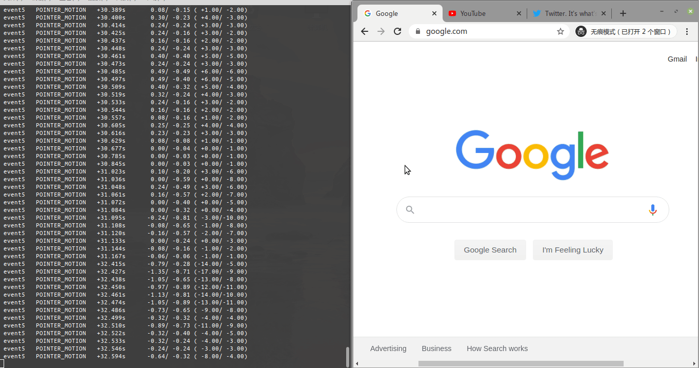

# x11-libinput-gestures
This project aims to introduce touchpad gestures on x11 systems using libinput and xdotools.

## Usage
Please first install `libinput-dev` and then type `make` to build the project. Use

```bash
./main <device>
```

to run the program, where `device` is a `/dev/input/eventX` device for your touchpad. You could run `libinput list-devices` to locate it.

## Supported Gestures
1. Three-finger gestures
    - Swipe left/right: Swich between windows
    - Swipe down: Show desktop
    - Swipe up: Show preview
    - Tap: Close current window [ctrl+w]

2. Four-finger gestures
    - Swipe left/right: Switch between workspaces

3. Two-finger gestures
    - Swipe left/right (fast): Go forward/backword [alt+Left/Right]
    - Swipe left/right (slow): Switch between tabs [ctrl+Tab/ctrl+shift+Tab]
    - Pinch in/out: Zoom in/out [ctrl+plus/minus]



## Configuration
No configuration file provided. If you want to customize the command, you could find `run("command")` in the source tree and modify it.
